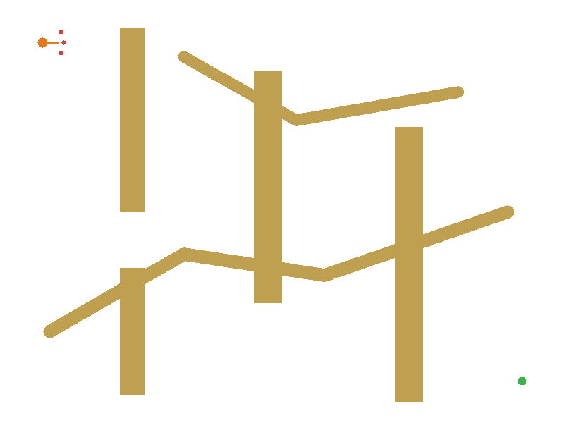
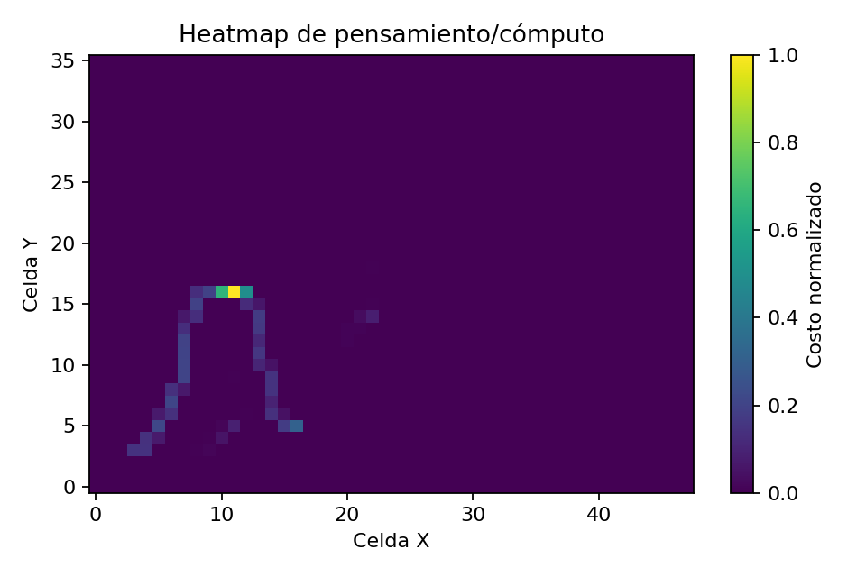

### ¿Cuándo debe pensar un agente RL?

**Cómputo adaptativo en tiempo de inferencia para navegación autónoma, razonamiento estructurado y análisis de sobrepensamiento.**

[](https://github.com/OWNER/REPO/actions/workflows/ci.yml)

Este repositorio presenta un entorno experimental para estudiar una pregunta central en agentes inteligentes: **cuándo conviene actuar de inmediato y cuándo conviene invertir más cómputo antes de decidir**. La idea se implementa en una tarea de navegación 2D, donde un agente debe desplazarse hacia una meta evitando obstáculos, pero el foco no está únicamente en llegar al objetivo. El foco está en observar, medir y comparar el proceso de decisión: cuánto razona el agente, qué estructura de razonamiento utiliza y qué rendimiento obtiene por cada unidad adicional de cómputo.

El proyecto traduce ideas recientes de razonamiento estructurado en modelos de lenguaje y agentes , como **Chain of Thought**, **Tree of Thoughts**, **Graph of Thoughts**, **RL of Thoughts**, presupuestos adaptativos de inferencia y análisis de *overthinking*,  a un dominio controlado de navegación autónoma. En vez de tratar el razonamiento como texto, lo representa como políticas, rollouts, árboles de acciones, grafos de waypoints, reflexión sobre riesgo y selección aprendida de estrategias de decisión.

La versión final compara **RLoT**, **GoT** y **Adaptive Budget** sobre el mismo mapa, la misma semilla y las mismas condiciones iniciales. También genera automáticamente GIFs, capturas, CSV, figuras, heatmaps y configuraciones de replay determinista para que los experimentos puedan ser inspeccionados, reproducidos y presentados en GitHub o en una exposición técnica.


#### Demo visual





La primera visualización muestra la comparación lado a lado entre estrategias de decisión. La segunda resume el **heatmap de pensamiento**, es decir, las zonas del entorno donde el agente decidió gastar más cómputo antes de actuar.

#### Tesis del proyecto

En muchos agentes, la inferencia se trata como una operación uniforme: ante cada estado, el sistema aplica siempre el mismo procedimiento de decisión. Sin embargo, los entornos secuenciales rara vez tienen dificultad uniforme. Algunas regiones son triviales: avanzar hacia la meta es suficiente. Otras regiones son ambiguas: hay obstáculos cercanos, posibles callejones sin salida, rutas equivalentes o decisiones que pueden tener consecuencias diferidas.

Este proyecto parte de la hipótesis de que un agente más eficiente no es necesariamente el que siempre razona más, sino el que **asigna su presupuesto de razonamiento de forma adaptativa**. En estados simples debe actuar con bajo coste. En estados difíciles debe planificar, simular alternativas, construir una representación más rica del entorno o reflexionar sobre el riesgo antes de ejecutar una acción.

El resultado es un banco de pruebas pequeño, reproducible y visual para estudiar la relación entre:

- rendimiento de navegación,
- coste de inferencia,
- profundidad o estructura del razonamiento,
- riesgo local del entorno,
- sobrepensamiento,
- reproducibilidad experimental.

#### Qué hace el proyecto

El repositorio implementa una tarea de navegación autónoma en dos dimensiones. El agente observa su posición, la meta y la distribución de obstáculos. En cada paso puede elegir una acción, pero esa acción puede ser producto de diferentes mecanismos de razonamiento. Algunos métodos actúan de manera directa, otros simulan trayectorias, otros construyen árboles, otros usan grafos, y otros deciden dinámicamente qué tipo de razonamiento activar.

La demostración final permite ejecutar tres familias de decisión sobre el mismo episodio:

1. **RLoT / RL of Thoughts**: un navegador que aprende a escoger entre varios bloques de razonamiento, como actuar directamente, usar una cadena corta, expandir un árbol, consultar un grafo o reflexionar.
2. **GoT / Graph of Thoughts**: una política que organiza hipótesis, riesgos, waypoints y dependencias como un grafo de decisión para navegar de forma más estructurada.
3. **Adaptive Budget**: una política que ajusta cuántos rollouts o simulaciones realizar en función de la dificultad local del estado.

Además de correr los episodios, el proyecto produce artefactos para análisis posterior. El CSV de trazas registra acciones, posiciones, recompensa, coste de decisión y eventos del entorno. El heatmap muestra dónde se concentró el gasto computacional. El análisis de sobrepensamiento estima si el agente obtuvo progreso real a cambio del cómputo adicional. El replay determinista permite repetir el episodio usando la misma semilla y la misma configuración.


#### Para qué sirve

Este proyecto sirve como una plataforma experimental para estudiar **test-time compute** en agentes secuenciales. En investigación moderna, el cómputo en tiempo de inferencia se ha vuelto tan importante como el entrenamiento: un sistema puede mejorar su desempeño no solo aprendiendo mejores pesos, sino también decidiendo cuánto buscar, deliberar, verificar o reflexionar antes de responder.

En este repositorio, esa idea se vuelve visible. Cuando el agente se acerca a una región con obstáculos, puede gastar más cómputo para evitar una mala trayectoria. Cuando el camino es despejado, puede actuar con menor coste. Esa diferencia permite discutir preguntas de nivel posgrado, por ejemplo:

- ¿cómo se mide el valor marginal de pensar más?,
- ¿en qué estados el cómputo adicional mejora la política?,
- ¿cuándo la deliberación produce sobrepensamiento?,
- ¿cómo comparar políticas con distinto coste de inferencia?,
- ¿qué estructura de razonamiento conviene en entornos con obstáculos, incertidumbre o rutas alternativas?,
- ¿cómo diseñar experimentos reproducibles para agentes que toman decisiones secuenciales?.

El repositorio no pretende resolver navegación autónoma real. Su valor está en aislar el problema conceptual: **la asignación adaptativa de razonamiento durante la inferencia**.


#### Relación con razonamiento estructurado

La motivación conceptual proviene de varias líneas de trabajo en razonamiento con modelos y agentes. En **Chain of Thought**, el razonamiento se organiza como una secuencia. En **Tree of Thoughts**, el sistema explora varias ramas alternativas antes de escoger una. En **Graph of Thoughts**, las unidades de razonamiento se conectan como nodos y aristas, permitiendo dependencias, combinación de ideas y retroalimentación. En **RL of Thoughts**, el problema se formula como una política que aprende qué estructura de razonamiento usar en cada caso.

Este proyecto reinterpreta esas ideas en navegación. Un "thought" no es necesariamente una frase, sino una operación computacional: simular una acción, expandir un árbol de trayectorias, consultar un waypoint, evaluar riesgo o activar una reflexión. De esta manera, el razonamiento se transforma en una decisión operacional: **qué procedimiento usar, cuánto cuesta y qué ganancia produce**.

La tabla resume la correspondencia principal:

| Concepto | Interpretación en el proyecto |
|---|---|
| Chain of Thought | Secuencia corta de evaluación antes de actuar |
| Tree of Thoughts | Expansión de múltiples ramas de acción a profundidad limitada |
| Graph of Thoughts | Grafo de waypoints, riesgos, hipótesis y dependencias |
| RL of Thoughts | Política que selecciona la estructura de razonamiento apropiada |
| Test-time compute | Cómputo usado durante la inferencia, no durante el entrenamiento |
| Adaptive Budget | Asignación variable de rollouts según dificultad del estado |
| Overthinking | Coste computacional alto con poco o nulo progreso adicional |

Más detalles se encuentran en [`docs/alineamiento_investigacion.md`](docs/alineamiento_investigacion.md).


#### Componentes implementados

El proyecto incluye varias políticas de decisión y herramientas de análisis. Todas están diseñadas para ser ligeras, reproducibles y fáciles de inspeccionar.

| Componente | Rol en el sistema |
|---|---|
| `BestOfNActions` | Simula varias continuaciones por acción y elige la de mejor retorno esperado |
| `TreeOfActions` | Expande un árbol de acciones antes de decidir, con coste proporcional a la búsqueda |
| `GraphOfWaypoints` | Convierte el mapa en una estructura de waypoints para planificación espacial |
| `AdaptiveRolloutBudget` | Aumenta o reduce el número de rollouts según dificultad local |
| `GoTNavigationGraphPolicy` | Usa una representación tipo grafo con hipótesis, riesgos, reflexión y consenso |
| `RLoTNavigator` | Selecciona dinámicamente entre `ACT`, `CHAIN`, `TREE`, `GRAPH` y `REFLECT` |
| `analyze_overthinking.py` | Calcula métricas de eficiencia computacional y posible sobrepensamiento |
| `demo_final.py` | Ejecuta la demostración completa y genera artefactos de presentación |
| `gui_dashboard.py` | Abre la interfaz Kivy para edición de mapas, comparación y visualización |


#### Instalación con entorno virtual `.agente`

Se recomienda usar un entorno virtual local llamado `.agente`. No se requiere Conda. El entorno virtual mantiene las dependencias aisladas del sistema y evita conflictos con otros proyectos de Python. Si se prefiere el nombre `.agentes`, basta con reemplazar `.agente` por `.agentes` en los comandos.

#### Linux o macOS

```bash
python -m venv .agente
source .agente/bin/activate
python -m pip install --upgrade pip setuptools wheel
```

#### Windows PowerShell

```powershell
py -m venv .agente
.\.agente\Scripts\Activate.ps1
python -m pip install --upgrade pip setuptools wheel
```

Si PowerShell bloquea la activación del entorno, puede habilitarse la ejecución de scripts para el usuario actual:

```powershell
Set-ExecutionPolicy -Scope CurrentUser RemoteSigned
.\.agente\Scripts\Activate.ps1
```

##### Windows CMD

```cmd
py -m venv .agente
.agente\Scripts\activate.bat
python -m pip install --upgrade pip setuptools wheel
```

Cuando el entorno esté activo, la terminal mostrará un prefijo similar a:

```text
(.agente)
```

Para salir del entorno:

```bash
deactivate
```

El directorio `.agente/` es local y no debe subirse a GitHub.


#### Instalación de dependencias

El proyecto separa las dependencias por perfil de uso.

Para ejecutar tests, generar figuras y correr la demo sin interfaz gráfica pesada:

```bash
python -m pip install -r requirements-ci.txt
```

Para usar la interfaz Kivy con editor de mapas:

```bash
python -m pip install -r requirements-gui.txt
```

Para experimentos más completos, incluyendo dependencias adicionales como PyTorch cuando estén disponibles en el entorno:

```bash
python -m pip install -r requirements.txt
```

También puede instalarse el paquete en modo editable:

```bash
python -m pip install -e .[dev]
```


#### Validación mínima

Después de instalar las dependencias, se recomienda ejecutar las pruebas automáticas:

```bash
pytest -q
```

La versión final fue validada con una batería de pruebas que cubre políticas de razonamiento, comparación lado a lado, replay determinista, heatmaps, exportación de artefactos y análisis de sobrepensamiento.


#### Demostración rápida

La demostración rápida sirve para confirmar que el entorno está correctamente instalado:

```bash
python demo_final.py --preset quick
```

La salida se genera en:

```text
results/final_demo_quick/
```

Este modo usa menos pasos y produce artefactos pequeños. Es útil para validación inicial o integración continua.


#### Demostración recomendada

La demostración principal se ejecuta con:

```bash
python demo_final.py --preset presentation
```

Este comando genera una carpeta con los artefactos necesarios para explicar el proyecto:

```text
results/final_demo/
├── DEMO_REPORT.md
├── episode_comparison.gif
├── comparison_trace.csv
├── overthinking_summary.csv
├── overthinking_summary.json
├── dashboard_snapshot.json
├── replay_config.json
├── captures/
└── figures/
```

Para una mejor revision, se recomienda abrir los archivos en este orden:

1. `results/final_demo/DEMO_REPORT.md`, para presentar el resumen del experimento.
2. `results/final_demo/episode_comparison.gif`, para mostrar la comparación visual entre métodos.
3. `results/final_demo/figures/thought_heatmap.png`, para explicar dónde se gastó más cómputo.
4. `results/final_demo/overthinking_summary.csv`, para discutir eficiencia y sobrepensamiento.
5. `results/final_demo/replay_config.json`, para mostrar la reproducibilidad del episodio.


#### Demostración total con GIF y MP4

Para una salida más completa, incluyendo video MP4 cuando el entorno tenga soporte de codificación:

```bash
python demo_final.py --preset full --mp4
```

La salida se genera en:

```text
results/final_demo_full/
```

> Este modo es el más apropiado cuando se desea preparar material para README, documentación, diapositivas o una presentación grabada.

#### Interfaz interactiva

La interfaz gráfica permite inspeccionar el comportamiento del agente de forma más exploratoria. Para interactuar con ella, escribe:

```bash
python -m pip install -r requirements-gui.txt
python gui_dashboard.py
```

Desde la interfaz se puede editar el mapa, pintar o borrar obstáculos, ejecutar comparaciones, visualizar heatmaps, generar snapshots y trabajar con replay determinista. Esta parte convierte el proyecto en una herramienta interactiva para construir escenarios y observar cómo cambia la asignación de cómputo cuando el entorno se vuelve más difícil.


#### Replay determinista

El replay determinista permite repetir exactamente un episodio. La configuración queda almacenada en `replay_config.json` e incluye la semilla, el escenario, el método y la configuración relevante del mapa. Esta propiedad es importante porque las políticas con simulaciones internas pueden ser difíciles de depurar si cada corrida produce trayectorias distintas.

En términos experimentales, el replay cumple tres funciones:

1. permite auditar una decisión específica del agente,
2. permite comparar métodos bajo condiciones idénticas,
3. permite generar figuras y reportes reproducibles para documentación.


#### Métricas de sobrepensamiento

Una contribución práctica del repositorio es el análisis de *overthinking*. La pregunta no es solamente si un método llega a la meta, sino si el cómputo adicional estuvo justificado por el progreso obtenido.

El script principal es:

```bash
python analyze_overthinking.py \
  --trace results/final_demo/comparison_trace.csv \
  --output results/final_demo/overthinking_summary.csv \
  --json results/final_demo/overthinking_summary.json
```

Las métricas incluyen progreso por unidad de cómputo, recompensa por cómputo, coste por progreso e índice de sobrepensamiento. Estas medidas ayudan a distinguir entre deliberación útil y gasto computacional redundante.

#### ¿Puede escalar a robots o vehículos autónomos?

Conceptualmente, sí. Este proyecto puede verse como un prototipo abstracto de una pregunta que aparece en robótica móvil, drones, manipulación y conducción autónoma: **cuánto planificar antes de actuar**. En un robot real, no todos los estados exigen el mismo nivel de deliberación. Un pasillo despejado puede requerir control reactivo, una intersección, una zona estrecha o una escena con obstáculos dinámicos puede requerir mayor planificación, verificación o evaluación de riesgo.

La correspondencia conceptual es directa:

| En este repositorio | En robótica o autonomía física |
|---|---|
| Mapa 2D discreto | Mapa local, occupancy grid o representación semántica |
| Obstáculos dibujados | Obstáculos detectados por sensores |
| Acción discreta | Comando de movimiento, waypoint o control local |
| Heatmap de pensamiento | Zonas de alta incertidumbre, riesgo o coste de planificación |
| Presupuesto adaptativo | Más cómputo en estados críticos, menos en estados simples |
| Replay determinista | Reproducción de escenarios en simuladores o bancos de prueba |

Sin embargo, el proyecto no es un sistema listo para conducción autónoma real. Para escalarlo hacia robots o vehículos serían necesarias varias capas adicionales: percepción con cámaras, LiDAR o radar, dinámica continua, control en tiempo real, planificación bajo incertidumbre, simulación física, validación de seguridad, integración con ROS 2, evaluación en simuladores como CARLA, Gazebo, Isaac Sim o MuJoCo y protocolos rigurosos de verificación.

Por eso, la lectura correcta es la siguiente: este repositorio no entrega un stack autónomo de producción, sino una **plataforma experimental para estudiar políticas de razonamiento adaptativo** que podrían inspirar módulos de planificación más sofisticados en sistemas robóticos.


#### Estructura del repositorio

```text
.
├── README.md                         # Presentación principal del proyecto
├── demo_final.py                     # Comando único para generar la demo final
├── generate_demo_artifacts.py        # Generador de GIF, CSV, figuras y snapshots
├── analyze_overthinking.py           # Métricas de coste, progreso y sobrepensamiento
├── gui_dashboard.py                  # UI Kivy y controlador testeable sin Kivy
├── rlot_got_navigation.py            # RLoT y GoT aplicados a navegación
├── reasoning_policies.py             # Políticas de razonamiento en inferencia
├── map.py                            # Entorno de navegación 2D
├── docs/
│   ├── assets/final_demo/            # GIFs, capturas y figuras visibles en GitHub
│   ├── alineamiento_investigacion.md # Relación con literatura y conceptos
│   ├── rlot_got.md                   # Documentación de RLoT y GoT
│   └── Interfaz_kivy.md              # Documentación de la interfaz Kivy
├── tests/                            # Pruebas automáticas
└── .github/workflows/ci.yml          # Integración continua
```

Los nombres de documentos de `docs/` pueden cambiarse sin afectar la ejecución, siempre que se actualicen los enlaces desde `README.md` u otros archivos. No conviene cambiar sin revisar configuración archivos como `pyproject.toml`, `requirements*.txt`, `demo_final.py`, `gui_dashboard.py` o `.github/workflows/ci.yml`, porque esos sí pueden estar referenciados por comandos, instalación o CI.

#### Limpieza antes de subir a GitHub

Antes de publicar el repositorio, se recomienda no subir entornos virtuales, cachés ni resultados generados. En Linux o macOS:

```bash
rm -rf .agente .venv venv env
rm -rf results build dist htmlcov .pytest_cache .mypy_cache .ruff_cache
find . -type d -name "__pycache__" -prune -exec rm -rf {} +
find . -type d -name "*.egg-info" -prune -exec rm -rf {} +
```

En Windows PowerShell:

```powershell
Remove-Item -Recurse -Force .agente, .venv, venv, env -ErrorAction SilentlyContinue
Remove-Item -Recurse -Force results, build, dist, htmlcov, .pytest_cache, .mypy_cache, .ruff_cache -ErrorAction SilentlyContinue
Get-ChildItem -Recurse -Directory -Force -Include "__pycache__", "*.egg-info" | Remove-Item -Recurse -Force
```

Deben conservarse los assets de presentación ubicados en `docs/assets/`, porque son parte de la documentación visible del repositorio.


#### Convenciones del proyecto

- Python 3.10 o superior.
- Entorno virtual local recomendado: `.agente/`.
- Demo reproducible sin APIs externas.
- Tests ligeros, sin entrenamiento pesado obligatorio.
- Documentación principal en español.
- Firmas públicas de funciones y módulos en inglés.
- Artefactos visuales de presentación en `docs/assets/`.
- Resultados generados en `results/`, excluidos del repositorio.


#### Alcance y limitaciones

El proyecto no implementa un sistema robótico real, no resuelve percepción, no controla dinámica continua y no incluye garantías de seguridad operacional. Su aporte es aislar y visualizar un problema más fundamental: **cómo un agente puede administrar su presupuesto de razonamiento durante la inferencia**.

En ese sentido, puede funcionar como punto de partida para extensiones hacia Gymnasium, ROS 2, CARLA, Isaac Sim, Gazebo o MuJoCo, pero esas integraciones deben tratarse como fases futuras.


#### Licencia y citación

Revisar [`LICENSE`](LICENSE) para los términos de uso. Si este repositorio se utiliza como base académica o demostración técnica, se recomienda citarlo mediante [`CITATION.cff`](CITATION.cff).